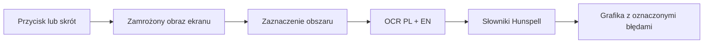

<div align="center">

# PreChecker

**Lokalne wykrywanie literówek bezpośrednio na projekcie graficznym.**

Zaznacz fragment ekranu, a PreChecker rozpozna tekst po polsku i angielsku,
sprawdzi pisownię i oznaczy podejrzane słowa dokładnie na obrazie.


</div>


## Po co?

Programy graficzne często nie podkreślają literówek, a przy logotypach, ulotkach,
plakatach i postach łatwo przeoczyć pojedynczy błąd. PreChecker działa obok dowolnej
aplikacji — Photoshopa, Illustratora, Figmy, przeglądarki czy edytora PDF — ponieważ
sprawdza wskazany fragment ekranu, a nie plik źródłowy.

## Co już działa

- zaznaczanie obszaru jak w systemowym narzędziu do wycinków,
- globalny skrót `Ctrl+Shift+K` na Windowsie i `Cmd+Shift+K` na macOS,
- lokalny OCR Tesseract dla języka polskiego i angielskiego jednocześnie,
- sprawdzanie pisowni przez słowniki Hunspell PL/EN,
- czerwone ramki umieszczone na konkretnych błędnych słowach,
- sugestie poprawek i prywatny słownik nazw własnych,
- obsługa wielu monitorów i skalowania ekranu,
- brak wysyłania zrzutów ekranu lub tekstu do sieci,
- instalator NSIS dla Windows x64.

## Jak to działa



Całe przetwarzanie odbywa się lokalnie. Zaznaczony obraz pozostaje w pamięci
i nie jest zapisywany na dysku przez aplikację.

## Szybki start

Wymagany jest Node.js `^20.19.0` albo `>=22.12.0`.

```powershell
git clone https://github.com/nacz0/PreChecker.git
cd PreChecker
npm install
npm run dev
```

Przy pierwszej instalacji skrypt `postinstall` kopiuje lokalne modele OCR `pol` i `eng`
do katalogu `resources/tessdata`.

## Najważniejsze polecenia

| Polecenie | Zastosowanie |
| --- | --- |
| `npm run dev` | Uruchomienie aplikacji w trybie developerskim |
| `npm run typecheck` | Kontrola typów TypeScript |
| `npm test` | Testy jednostkowe słowników i reguł pisowni |
| `npm run test:e2e` | Pełny test Electron: zaznaczenie → OCR → wynik |
| `npm run test:memory` | Profil pamięci przed skanem, po skanach i po bezczynności |
| `npm run build` | Produkcyjny build do katalogu `out/` |
| `npm run dist:win` | Instalator Windows x64 do katalogu `release/` |
| `npm run test:release:win` | E2E na rozpakowanej aplikacji release |
| `npm run dist:mac` | DMG dla Apple Silicon i Intela — uruchamiane na macOS |

## Release Windows

```powershell
npm run typecheck
npm test
npm run dist:win
npm run test:release:win
```

Instalator ma nazwę `PreChecker-Setup-<wersja>-x64.exe`. Modele OCR są dołączane
do paczki jako zasoby offline. Niepodpisany instalator może wyświetlić ostrzeżenie
Windows SmartScreen; publiczne wydanie powinno otrzymać podpis cyfrowy i własną ikonę.

## Pamięć i szybkość

Electron oraz Tesseract uruchamiają kilka procesów i worker WebAssembly, dlatego zużycie
pamięci rośnie na czas OCR. PreChecker ogranicza koszt w spoczynku:

- słowniki są ładowane dopiero przy pierwszym użyciu,
- współrzędne słów są pobierane przez lekki format TSV zamiast pełnego drzewa OCR,
- worker OCR jest zamykany po 10 sekundach bezczynności,
- słowniki są zwalniane po 30 sekundach bezczynności.

Pierwszy skan po uruchomieniu lub uśpieniu workera trwa dłużej. Kolejne skany wykonane
w krótkim odstępie korzystają z już załadowanego silnika.

## Testy OCR

Test E2E wyświetla prawdziwe plansze na ekranie, zaznacza obszar nakładką i sprawdza
wynik w interfejsie. Aktualny zestaw zawiera dziewięć celowych błędów:

| Plansza | Błędy |
| --- | --- |
| `poster-pl.svg` | `WYPRZEDARZ`, `Najleprze`, `wiencej` |
| `poster-en.svg` | `Recieve`, `avalable`, `Adress` |
| `poster-mixed.svg` | `ŚWIERZO`, `COLECTION`, `desing` |

W testach Windows wszystkie `9/9` słów są wykrywane i otrzymują ramki na obrazie.
Pliki testowe znajdują się w [`tests/fixtures`](tests/fixtures).

## macOS

Kod używa wieloplatformowych API Electrona, Tesseracta i Hunspella. Przy pierwszym
uruchomieniu macOS powinien poprosić o dostęp do:

`System Settings → Privacy & Security → Screen Recording`

Po nadaniu uprawnienia aplikację trzeba zwykle uruchomić ponownie. Bez fizycznego Maca
nie zostały jeszcze potwierdzone zachowanie na ekranach Retina, skrót globalny,
podpisywanie, notaryzacja ani gotowa paczka DMG.

## Struktura projektu

```text
src/
├── main/       proces główny, przechwytywanie, OCR i słowniki
├── preload/    bezpieczny most IPC
├── renderer/   interfejs i nakładka zaznaczania
└── shared/     współdzielone typy
resources/
└── tessdata/   lokalne modele OCR PL/EN
tests/
└── fixtures/   plansze z kontrolowanymi literówkami
```

## Ograniczenia MVP

- Sprawdzanie bazuje na słownikach, a nie pełnym modelu gramatycznym. Nie wykryje każdego
  błędu zależnego od kontekstu, np. `nową kolekcje` zamiast `nową kolekcję`.
- Nazwy marek i nazwiska mogą zostać zgłoszone jako podejrzane; można je dodać do
  lokalnego słownika.
- Mały, obrócony, rozmyty lub mocno stylizowany tekst może obniżyć skuteczność OCR.
- Publiczne paczki Windows i macOS nie są jeszcze podpisane.

## Prywatność

PreChecker nie posiada backendu, telemetrii ani integracji chmurowej. OCR, słowniki,
zrzuty i prywatny słownik użytkownika pozostają na jego komputerze.
